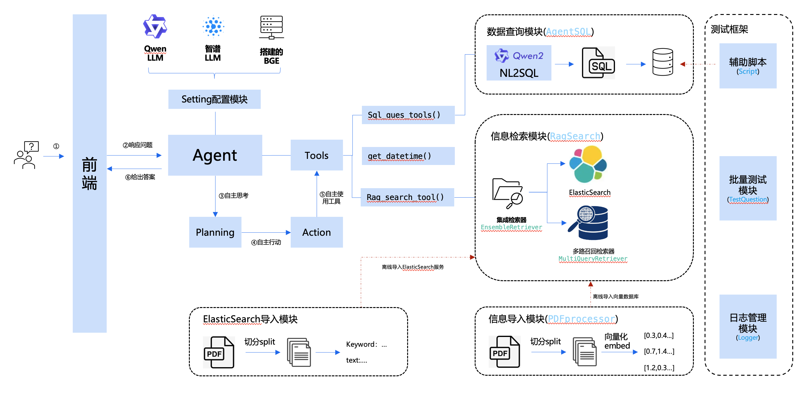

# 光环结业项目

## 介绍
金融千问机器人是一个 基于 `LLM` + `Agent` + `RAG` 的智能问答系统，该项目源于阿里天池的挑战赛。

- **赛事内容地址**：https://tianchi.aliyun.com/competition/entrance/532172

- **开源参考代码**：https://github.com/Tongyi-EconML/FinQwen

- **项目计划地址**：https://docs.qq.com/sheet/DTGVMSWtkendacmRl?tab=3qh6in


## 项目架构
根据之前参赛项目的经验，该项目预计的项目架构图如下：



## 目录说明

```bash
smart-finance-bot \
    |- dataset \  # 该目录用于保存PDF以及SQLite数据
    |- doc \  # 该目录用于保存文档类文件，例如：需求文档、说明文档、数据文档
    |- app \   # 该目录用于服务端代码
        |- agent \ # 该目录用于保存agent相关代码
        |- rag \   # 该目录用于保存rag相关代码
        |- test \   # 该目录用于保存测试类驱动相关代码
        |- conf \  # 该目录用于保存配置文件
            |- .qwen # 该文件保存QWen的配置文件(请自行添加对应的API KEY)
            |- .ernie # 该文件保存百度千帆的配置文件(请自行添加对应的API KEY)
    |- chatweb \   # 该目录用于保存前端页面代码
    |- scripts \   # 该目录用于保存脚本文件，例如：启动脚本、导入向量数据库脚本等
    |- test_result \   # 该目录用于保存测试结果
    |- docker \
        |- backend \ # 该目录对应后端python服务的Dockerfile
        |- frontend \ # 该目录对应前端python服务的Dockerfile
```

## 使用说明

### 1、拉取代码
```shell
git clone --recurse-submodules https://gitee.com/deadwalk/smart-finance-bot.git
```

> Git客户端[gitee使用教程](https://blog.csdn.net/weixin_50470247/article/details/133585369)

### 2、安装依赖
`cd smart-finance-bot`，进入工程根目录后，运行如下命令安装依赖

```bash
# 安装依赖前，强烈建议使用conda虚拟环境，例如：
# conda create --name langchain python=3.10
# conda activate langchain

pip install -r requirements.txt
```

> 注意：经过实际测试Python 3.11版本会存在依赖冲突问题，所以请将Python版本切换为3.10。

### 3、配置大模型的APIKey
打开配置文件 app/conf的配置文件，配置自己的API Key即可。

> 备注：
> - `.qwen` 文件中对应QWen的API Key
> - `.ernie` 文件中对应百度千帆的API Key
> - `.zhipu` 文件中对应智谱的API Key

如果想测试API-KEY是否生效，可以参照 `附录` 中 `关于如何配置智谱大模型` 的章节内容。

### 4、准备向量数据库
1. 访问网盘下载链接
下载地址：https://share.weiyun.com/wa3QocyY
2. 下载 `chroma_db_bge_0911`
3. 将`chroma_db_bge_0911`移动至`smart-finance-bot`目录下，并重命名为`chroma_db`。
```
smart-finance-bot\
    |-chroma_db     # ←放在这个位置
    |-app
```

### 5、启动Chroma数据库
Linux/Mac用户：
```shell
# 切换/保持当前目录为 smart-finance-bot
cd smart-finance-bot

# 启动Chroma数据库
./scripts/start_chroma.sh
```

Windows用户：
```bash
chroma run --path /chroma_db 

scripts\start_chroma.bat
```

### 6、开展工作
注意：此处后续的工作因为需求不尽相同，所以请根据需求选择对应的内容阅读。
- 如果你是要执行自动化测试，请查看 `6.1 批量化执行问题提问测试方法` 。
- 如果你是想启动后端和前端查看Demo效果，请查看 `6.2 启动后端和前端查看Demo效果` 。
- 如果你是想进行代码调试，请查看 `6.3 代码调试方法` 。

#### 6.1 批量化执行问题提问测试方法
#####  SQLite数据库批量建立索引方法
**第一步**：执行命令给SQLite数据库建立索引
```bash 
# 切换/保持当前目录为 smart-finance-bot
cd smart-finance-bot

# 运行添加索引脚本
./scripts/run_addindexs.sh
```
> 注意：该项工作仅运行一次即可。

##### 配置自动化测试的start和end用例序号
**第二步**：配置自动化测试的start和end用例序号

Linux/Mac用户：
1. 编辑`scripts/run_test_cases.sh` 文件
2. 修改 `--start` 和 `--end` 参数（下面是一个执行 0~100 的例子）。
```bash
python "$PYTHON_SCRIPT" --job test_question --start 0 --end 100
```

Windows用户：
1. 编辑`scripts\run_test_cases.bat` 文件
2. 修改 `--start` 和 `--end` 参数（下面是一个执行 0~100 的例子）。

```bash
python "%PYTHON_SCRIPT%" --job test_question --start 0 --end 100
```

##### 执行自动化脚本
**第三步**：运行测试脚本
```bash
# 切换/保持当前目录为 smart-finance-bot
cd smart-finance-bot

# 运行测试脚本（Linux/Mac用户）
./scripts/run_test_cases.sh

# 运行测试脚本（Windows用户）
scripts\run_test_cases.bat
```
> 说明：
> 1. Window用户注意运行对应的 bat 文件。
> 2. 测试结果会保存在 `test_result` 目录中，其中 `.json` 是问题运行的结果，`.log` 是运行日志。
> 3. 如果执行过程中出现异常中断，请重新执行上述脚本，脚本会提示是否断点续跑，选择Y即可。

#### 6.2 启动后端和前端查看Demo效果
以下是启动后端和前端查看效果的方法：

##### 启动后端服务
```bash
# 切换/保持当前目录为 smart-finance-bot
cd smart-finance-bot

# 启动服务
python app/server.py

```

##### 启动前端服务
**第一步**：安装Node.js
- 访问https://nodejs.cn/download/
- 按照页面提示下载Node.js到本地后进行安装

**第二步**：安装依赖包(首次运行一次即可)
```bash
# 进入chatweb目录
cd chatweb

# 安装依赖包
npm install
```

**第三步**：启动前端服务
```bash
# 启动服务
npm run dev
```
启动完毕后，按照提示访问 `http://localhost:5173/` 即可查看效果。


#### 6.3 代码调试方法
- 如果你使用的开发工具是 VsCode，可以参考如下步骤：
  - 使用vscode打开smart-finance-bot工程根目录。
  - 在app目录下找到test_framework.py文件
  - 启用vscode的调试模式即可。

- 如果你使用的开发工具是 pycharm，可以参考如下步骤：
  - 使用pycharm打开app目录。(特别注意：pycharm需要将app目录设置为项目根目录)
  - 找到test_framework.py文件
  - 启用调试模式即可。

## 附录
### 关于批量导入PDF到向量库的方法
> ！！注意：执行导入脚本前，请确保没有使用命令行启动 `Chroma` 向量数据库。

Linux/Mac用户：
```shell
# 切换/保持当前目录为 smart-finance-bot
cd smart-finance-bot

# 给shell脚本赋予运行权限
chmod +x ./scripts/import_pdf.sh

# 启动批量导入脚本
./scripts/import_pdf.sh
```

Windows用户：
```bash
scripts\import_pdf.bat
```

### 关于如何配置智谱大模型地方法
1. 访问智谱开放平台https://bigmodel.cn/
2. 注册账号并且登录
3. 在 `API密钥` 中创建自己的API Key
4. 在 `conf/.zhipu` 文件中配置好第3步创建好的密钥
5. 在 `app/settings.py` 中修改全局配置CHAT的赋值，即： `CHAT = get_zhipu_models(model="glm-4-plus")`
6. 至此，大模型修改完毕，你可以使用 `test_framework.py` 中的 `test_llm_api()` 进行测试。


### 关于使用Docker部署后端和前端服务的方法
#### 1、准备Docker运行环境
安装Docker，具体方法不再赘述，可以查看[10分钟学会Docker的安装和使用](https://blog.csdn.net/yohnyang/article/details/138435593)

#### 2、下载Docker-Compose文件
命令行下运行
```bash
curl -L https://github.com/docker/compose/releases/tag/v2.28.0/docker-compose-`uname -s`-`uname -m` > /usr/local/bin/docker-compose
```

#### 3、启动服务
```bash
docker-compose -f docker-compose-base.yaml up -d
```
> - `docker-compose-base.yaml` 对应是只启动基础的服务，包括python后端、nodejs前端、Chroma数据库服务。
> - `docker-compose-es.yaml` 对应是只启动ElasticSearch服务的配置
> - `docker-compose-all.yaml` 对应是启动所有服务的配置，包括Python后端服务、前端nodejs、ElasticSearch服务等。


### 关于启动ElasticSearch(简称ES)服务的方法
第一步：vim 编辑 `/etc/sysctl.conf`，增加 `vm.max_map_count` 
```bash
vm.max_map_count=262144
```
编辑之后，运行以下命令以应用更改:
```bash
sudo sysctl -p
```
第二步：检查 docker/elasticsearch 目录下是否有读写权限。

第三步：运行如下命令启动ES服务

```bash
docker-compose -f docker-compose-es.yaml up -d
```

