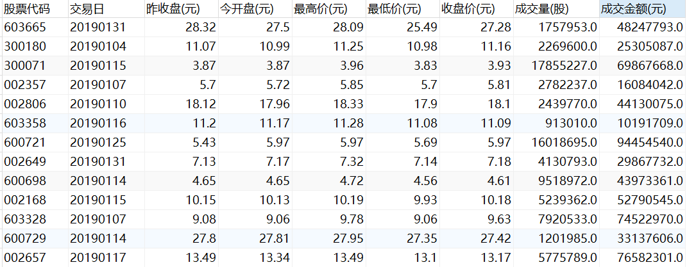

## 我们有什么？数据观察
提供三类数据。一个是10张数据表，一个是招股说明书，以及将招股说明书pdf解析后的txt文件。
### 非结构化数据：80家招股说明书（文本数据）
#### 一个概念 
  - 招股说明书：正式的法律文件，通常由计划进行首次公开发行（IPO）的公司编制并发布。包含了关于公司的详细信息，旨在向**潜在投资者提供足够的信息**以便他们做出投资决定。核心披露信息：产品和服务、行业中的位置、财务报告，我理解就是个**广告**。
#### 数据样例
  - pdf 样例（原始文档，人看）： 
    - 文件样例：file:///D:/work/98-p/06-AILesson/00-%E9%A1%B9%E7%9B%AE/bs_challenge_financial_14b_dataset/pdf/0b46f7a2d67b5b59ad67cafffa0e12a9f0837790.PDF
    - 大小：527M
    - 数量：80份 
    - 截图样例：  
  - txt 样例（由pdf转换而来，机器看）：
    - 文件样例：file:///D:/work/98-p/06-AILesson/00-%E9%A1%B9%E7%9B%AE/bs_challenge_financial_14b_dataset/pdf_txt_file/0b46f7a2d67b5b59ad67cafffa0e12a9f0837790.txt
    - 文件截图：
    - 大小：44M
    - 数量：80份
  - 文件路径结构：
    - pdf文件名与txt文件名相同

### 结构化数据：10张数据表（数据库数据）    
#### 关系概述
- **核心表**:
  - **基金基本信息**作为中心表，与所有基金相关的表通过基金代码关联。
  
- **持仓表**:
  - **基金股票持仓明细**、**基金债券持仓明细**、**基金可转债持仓明细**记录了基金的具体投资组合，这些表通过基金代码与**基金基本信息**表关联。
  
- **行情表**:
  - **基金日行情表**记录基金的每日价格变动。
  - **A股票日行情表**和**港股票日行情表**记录股票的每日价格变动，这些表可以通过股票代码与**基金股票持仓明细**表关联。
  
- **辅助表**:
  - **A股公司行业划分表**提供了股票所属行业的信息，与**A股票日行情表**中的股票代码关联，也可能间接与**基金股票持仓明细**关联。
  - **基金规模变动表**和**基金份额持有人结构**则分别记录了基金规模的变化和持有人的信息，与**基金基本信息**通过基金代码关联。基金规模变动表，按季度统计。基金份额持有人结构，按半年统计。

#### 表间关系
| 表名 | 描述 | 关联表 |
| --- | --- | --- |
| 基金基本信息 | 包含基金的基本信息，如基金代码、名称、成立日期等。 | - |
| 基金股票持仓明细 | 记录了基金持有的股票详情，包括持股数量、比例等。 | 基金基本信息 (基金代码) |
| 基金债券持仓明细 | 记录了基金持有的债券详情。 | 基金基本信息 (基金代码) |
| 基金可转债持仓明细 | 记录了基金持有的可转换债券详情。 | 基金基本信息 (基金代码) |
| 基金日行情表 | 描述基金每日的价格变化情况。 | 基金基本信息 (基金代码) |
| A股票日行情表 | 描述A股市场内单个股票的日行情数据。 | 基金股票持仓明细 (股票代码) |
| 港股票日行情表 | 描述港股市场内单个股票的日行情数据。 | 基金股票持仓明细 (股票代码) |
| A股公司行业划分表 | 描述A股上市公司的行业分类。 | A股票日行情表 (股票代码) |
| 基金规模变动表 | 记录基金规模的变化情况。 | 基金基本信息 (基金代码) |
| 基金份额持有人结构 | 描述基金的持有人类型及其持有比例。 | 基金基本信息 (基金代码) |

#### 具体10张数据表
  - 基金基本信息  
  - 基金股票持仓明细    
  - 基金债券持仓明细  
  - 基金可转债持仓明细 
  - 基金日行情表 
  - A股票日行情表 
  - 港股票日行情表 
  - A股公司行业划分表 
  - 基金规模变动表 
  - 基金份额持有人结构 

### 关键字段与解释
  - **澄清下**，具体什么是基金，什么是股票，什么可转债，什么是债券等等，可以不用管，关键是理解他们之间的**逻辑关系和关联字段**。
  - 基金代码：唯一标识一只基金的代码。和其他数据关联的唯一标识。如关联所有基金持仓明细。
  - 日行情：价格变化情况，包括开盘价、收盘价、最高价、最低价等，根据价格走势，进行交易。
  - 规模变动：季度变化情况。
  - 份额持有人结构：半年度机构和个人持有情况。
  - 招股说明书：正式的法律文件，通常由计划进行首次公开发行（IPO）的公司编制并发布。包含了关于公司的详细信息，旨在向**潜在投资者提供足够的信息**以便他们做出投资决定。

## 基本目标是什么？大致猜测
### 提问情况
- 数据：1000个问题，json格式，包括问题序号，问题。
- 
- 提问情况分析：1、需要通过在结构化表中进行数据查询，才可获取的；2、招股说明书中提到的内容
   
### 大赛评价标准

### 目标
通过原始问题和评判标准，可以认为，需要两类任务：
- 第一类是文本理解
  - 问题分类
  - 招股说明书加工为可训练数据
  - 验证
- 第二类是信息提取
  - 
- 两类合并
  - 通过LangChain中MessagePlaceholder消息占位打在一起输出。

一、题目分类
基于千问模型，将题目分成文本理解题和数据处理题两大类。
题目中主体公司为有招股说明书的公司，则分类为文本理解题，其余为信息提取题。
二、文本理解题处理
问题分类后，基于问题中提及的公司和招股书文档进行对应，对文档进行chunk切分，检索问题最相关的文档chunk，设计prompt进行问题回答，具体实现。
三、数据查询题处理
设计prompt，千问模型生成相应的SQL语句，并与问题一同输入千问模型，得到最终答案。
四、 合并整理数据查询题与文本理解题
最后输出结果。

- 考试报名
  
https://github.com/yann168/boshi-sample-solution?spm=a2c22.12281978.0.0.c4eb2461ynixE1
原材料 目标 如何做？
数据分析，增加关系图，以及金融词汇解释说明
目标分析，题目中主体公司为有招股说明书的公司，则分类为文本理解题，其余为信息提取题

Step 1: 题目分类
基于千问模型，提取出80篇招股说明书所属公司，具体实现请参考extract_company_names；
使用 split_questions_by_type 将1000道题目分成文本理解题和数据处理题两大类，以便后续分别设计不同解题思路。
题目中主体公司为有招股说明书的公司，则分类为文本理解题，其余为信息提取题
Step 2: 文本理解题处理
问题分类后，基于问题中提及的公司和招股书文档进行对应，对文档进行chunk切分，检索问题最相关的文档chunk，设计prompt进行问题回答，具体实现，请参考swifter_process_text_questions函数。
Step 3: 数据查询题处理
设计prompt，千问模型生成相应的SQL语句
对每一题，输入给千问模型10张表的表名字段名和少量数据样本，让千问回答解决问题的SQL语句
针对qwen生成的回复，提取回答中的SQL语句，并基于规则的方式，进行进一步的refine；
执行SQL语句得到得出数据库查询结果，并与问题一同输入千问模型，得到最终答案；
Step 4: 合并整理数据查询题与文本理解题
使用函数 integrate_outputs，最后输出结果。